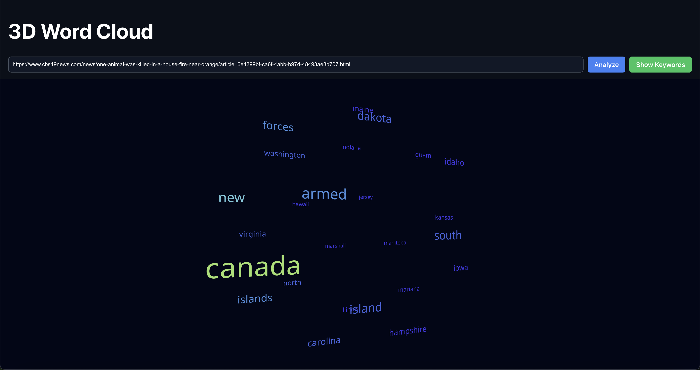
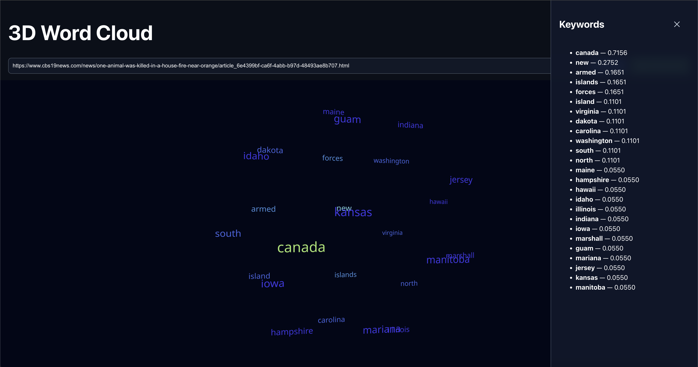

# 3D Word Cloud – Article Keyword Visualization

A full-stack web application that generates an **interactive 3D word cloud** from a **publicly accessible article URL**.

The system fetches article content, extracts important keywords using NLP techniques, and visualizes them in a 3D layout to help users quickly understand the main themes of an article.

---

## What the Application Does

- Accepts an **open, publicly accessible article URL**
- Downloads and parses article text
- Extracts keywords using **TF-IDF**
- Assigns relevance weights to each keyword
- Renders an **interactive 3D word cloud** where size and color reflect importance

⚠️ Paywalled, login-restricted, or blocked websites may not work.

---

## Project Structure
```
3d-wordcloud/
├── backend/
│ ├── app/main.py
│ └── requirements.txt
├── frontend/
│ ├── src/
│ ├── public/
│ ├── index.html
│ ├── package.json
│ └── vite.config.ts
├── images/
│ ├── 3d-wordcloud-visualization.png
│ └── 3d-wordcloud-keywords-panel.png
└── README.md
```

---
## 🖼 Application Preview

### 3D Word Cloud Visualization


### Keyword Weights Panel


---
## Backend

- Built using **FastAPI**
- Uses `newspaper3k` to extract article text
- Applies **TF-IDF** (scikit-learn) for keyword extraction
- Exposes a `/analyze` API returning keywords and weights
- Includes a `/health` endpoint for status checks

---

## Frontend

- Built using **React + TypeScript**
- Uses **Vite** for development
- Sends article URLs to the backend API
- Displays an interactive **3D word cloud**
- Visual emphasis is based on keyword relevance

---

## Keyword Extraction Logic

- Article text is cleaned and vectorized
- Stop words are removed
- Top-ranked terms are selected using TF-IDF scores
- Each term is returned with a numeric weight
- These weights control visual emphasis in the 3D layout

---

## Tech Stack
- **Backend:** Python, FastAPI, newspaper3k, scikit-learn, NumPy  
- **Frontend:** React, TypeScript, Vite 
---

## How to Run Locally

### Backend
```bash
cd backend
python -m venv venv
source venv/bin/activate
pip install -r requirements.txt
uvicorn app.main:app --reload
```
Runs at: ```http://localhost:8000```

### Frontend
```
cd frontend
npm install
npm run dev
```

Runs at: ```http://localhost:5173```

## Contact
Email: sriyareddy696@gmail.com

Feel free to reach out for any questions or feedback.
